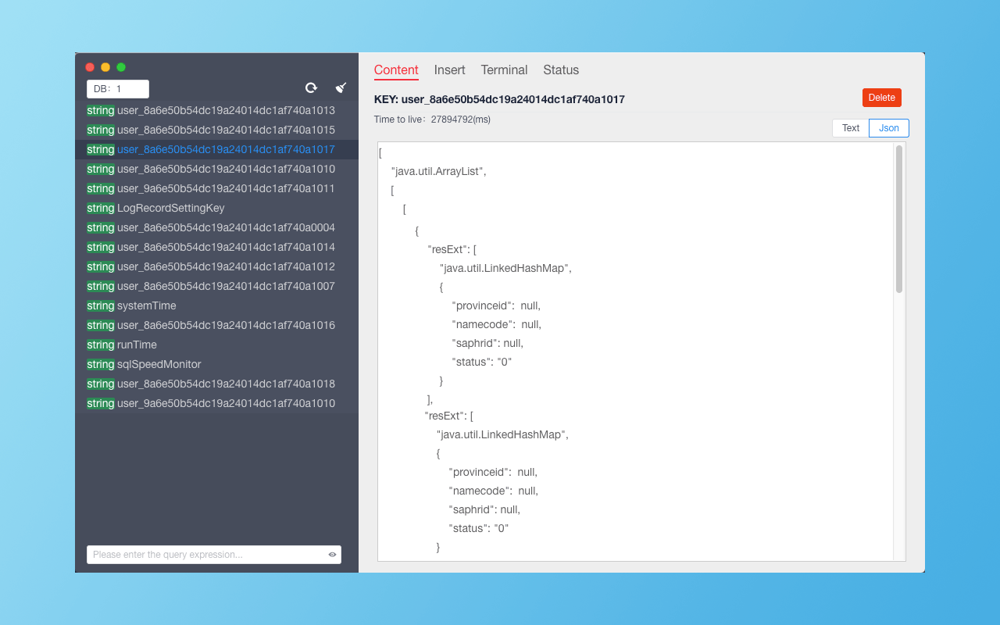
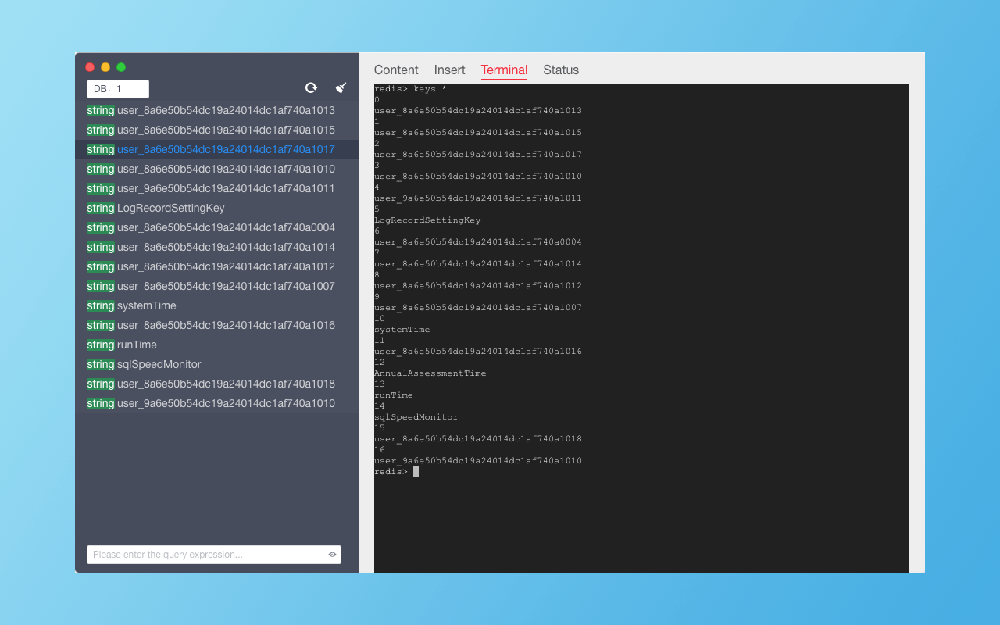

## ImiRedis is a GUI Redis Client

### Multiple services and database management.

### GUI operation & CLI command.

### Multiple data types (String, list, etc.)

### Find keys quickly by regular expression or fuzzy search.

### Support or Contact

